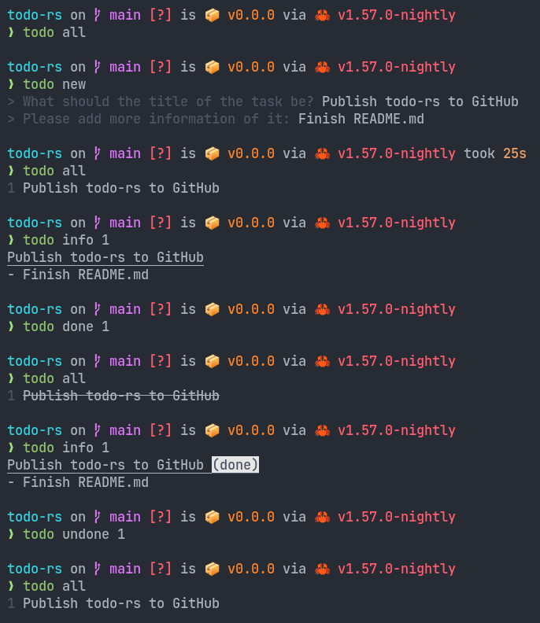

# todo-rs

Tasks CLI app for terminal.

## Warning

Note this is only tested in Linux and may not work properly on other platforms.

## Install

Requirements:

- [Cargo (rust)](https://www.rust-lang.org/)

Run the follwing command:

```
cargo install --git https://github.com/Brian3647/todo-rs.git
```

## Usage


